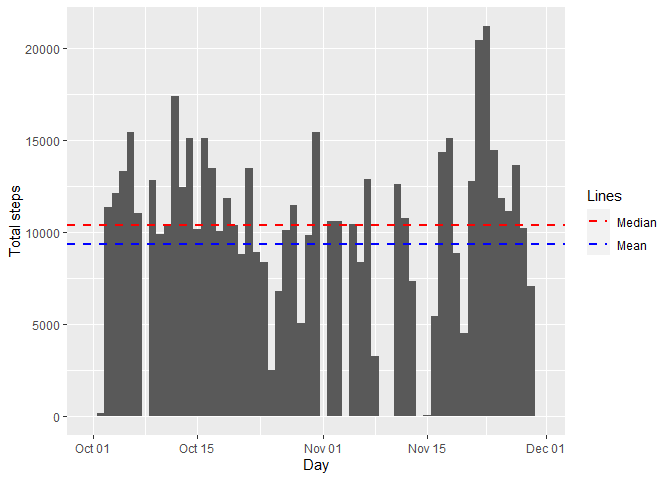
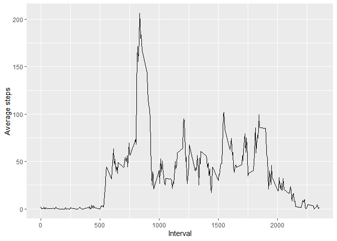
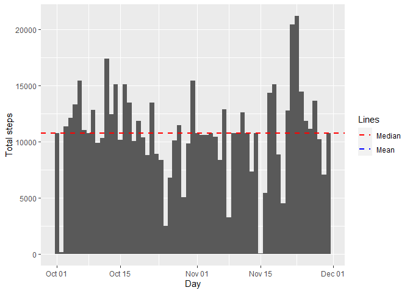
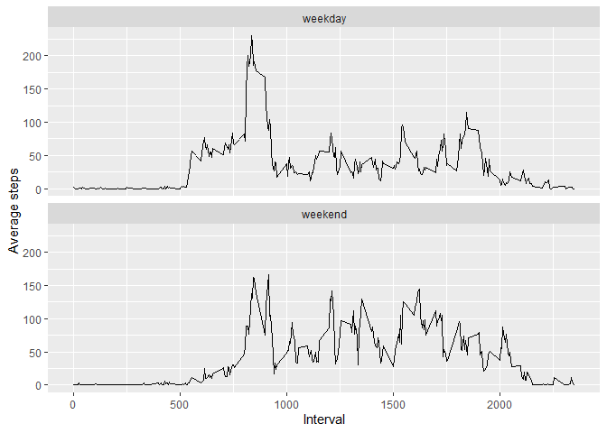

## Loading and preprocessing the data

First we'll perform some basic setup, loading the required ggplot2 library and verifying
the dataset is available in the working directory.  
The zip file with the dataset is already contained inside this repository. However,
we'll first confirm it is present or download it otherwise:


```r
#Load required libraries

if(!require("ggplot2")){
        stop("ggplot2 library missing. Please install ggplot2 and try again")
}
```

```
## Loading required package: ggplot2
```

```r
#Setup default chunk options

knitr::opts_chunk$set(echo = TRUE)

# Basic code to download the required files and read them

if(!file.exists("activity.zip")){
        message("Dataset missing in working directory. Downloading...")
        download.file("https://d396qusza40orc.cloudfront.net/repdata%2Fdata%2Factivity.zip","activity.zip",method="curl")
        if(!file.exists("data.zip")){
                stop("Download failed! Please retry later.")
        }
} else{
        message("Dataset present in working directory, skipping download.")
}
```

```
## Dataset present in working directory, skipping download.
```

Now that we know everything is loaded, let's start by reading the dataset into memory.  
To do that we'll use the *read.csv* and *unz* functions to read the csv file inside the zip archive.


```r
dataset <- read.csv(unz("activity.zip", "activity.csv"),header=TRUE)
```

We now cast the date variable as date:


```r
dataset$date <- as.Date(dataset$date,"%Y-%m-%d")
```

We finally verify that everything is in order by using *str*:


```r
str(dataset)
```

```
## 'data.frame':	17568 obs. of  3 variables:
##  $ steps   : int  NA NA NA NA NA NA NA NA NA NA ...
##  $ date    : Date, format: "2012-10-01" "2012-10-01" ...
##  $ interval: int  0 5 10 15 20 25 30 35 40 45 ...
```

The dataset is now ready to perform the analysis!

## What is mean total number of steps taken per day?

To answer this question, we first calculate the *sum* (ignoring NAs with na.rm=TRUE) of steps per day using *tapply*, then create a dataframe to hold the results. Using this dataframe we calculate the mean and median of the total steps per day.  


```r
sumsDates <- tapply(dataset$steps,dataset$date,sum,na.rm=TRUE)

sums <- data.frame(date =  as.Date(names(sumsDates),"%Y-%m-%d"),steps = sumsDates)

stepsMean <- mean(sums$steps)

stepsMedian <- median(sums$steps)
```

Then, we setup a ggplot object and plot the histogram of steps per day. We add the median and mean as horizontal lines and a legend to the plot. Note that by using the *weight* aesthetic *geom_histogram* will graph the total number of steps per day.


```r
graph <- ggplot(sums,aes(x=date))

hist <- graph + geom_histogram(aes(weight=steps),bins=61) + 
        geom_hline(aes(yintercept=stepsMean,color="blue"), linetype="dashed", size=1,na.rm=TRUE) + 
        geom_hline(aes(yintercept=stepsMedian, color="red"), linetype="dashed", size=1,na.rm=TRUE) +
        labs(x="Day",y="Total steps") +
        scale_color_identity(name = "Lines", breaks = c("red", "blue"), labels = c("Median", "Mean"),guide = "legend")

print(hist)
```

<!-- -->

To know the exact values of the median and mean, let's print them:


```r
print(paste("Median:",as.character(stepsMedian)))
```

```
## [1] "Median: 10395"
```

```r
print(paste("Mean:",as.character(stepsMean)))
```

```
## [1] "Mean: 9354.22950819672"
```

## What is the average daily activity pattern?

We'll use a similar approach for this question. We start by calculating the average number of steps per interval using *tapply*, then create a dataframe with this information and plot it using ggplot. This time, we use a *line* geom to get a time series showing the average daily activity pattern.


```r
meansIntervals <- tapply(dataset$steps,dataset$interval,mean,na.rm=TRUE)

means <- data.frame(interval =  as.integer(names(meansIntervals)),steps = meansIntervals)

graph <- ggplot(means,aes(x=interval,y=steps))

lines <- graph + geom_line() + labs(x="Interval",y="Average steps")

print(lines)
```

<!-- -->

To print the precise interval that contains the maximum number of steps in average we use the *which.max* function:


```r
print(paste("Maximum interval:",means$interval[which.max(means$steps)]))
```

```
## [1] "Maximum interval: 835"
```

## Imputing missing values

We'll start by counting how many rows with missing values are in the dataset:


```r
sum(!complete.cases(dataset))
```

```
## [1] 2304
```

We can also verify which variables have missing values using summary:


```r
summary(dataset)
```

```
##      steps             date               interval     
##  Min.   :  0.00   Min.   :2012-10-01   Min.   :   0.0  
##  1st Qu.:  0.00   1st Qu.:2012-10-16   1st Qu.: 588.8  
##  Median :  0.00   Median :2012-10-31   Median :1177.5  
##  Mean   : 37.38   Mean   :2012-10-31   Mean   :1177.5  
##  3rd Qu.: 12.00   3rd Qu.:2012-11-15   3rd Qu.:1766.2  
##  Max.   :806.00   Max.   :2012-11-30   Max.   :2355.0  
##  NA's   :2304
```

Only the steps variable has missing values. There are many possible strategies to fill those in, but we'll use the *average* for each 5 minute interval that we calculated in the previous section. Using a *for* loop we complete the missing data, and print a *summary* of the new dataset to verify that the missing values have been replaced:


```r
completeDataset<-dataset

for(i in 1:nrow(completeDataset)) {
        if(is.na(completeDataset[i,"steps"])){
                completeDataset[i,"steps"] <- means[means$interval == completeDataset[i,"interval"],"steps"]
        }
}

summary(completeDataset)
```

```
##      steps             date               interval     
##  Min.   :  0.00   Min.   :2012-10-01   Min.   :   0.0  
##  1st Qu.:  0.00   1st Qu.:2012-10-16   1st Qu.: 588.8  
##  Median :  0.00   Median :2012-10-31   Median :1177.5  
##  Mean   : 37.38   Mean   :2012-10-31   Mean   :1177.5  
##  3rd Qu.: 27.00   3rd Qu.:2012-11-15   3rd Qu.:1766.2  
##  Max.   :806.00   Max.   :2012-11-30   Max.   :2355.0
```

We can see that there are no NAs left. Let's recreate the histogram using this new dataset and recalculate the median and mean:


```r
sumsDates <- tapply(completeDataset$steps,completeDataset$date,sum,na.rm=TRUE)

sums <- data.frame(date =  as.Date(names(sumsDates),"%Y-%m-%d"),steps = sumsDates)

stepsMean <- mean(sums$steps)

stepsMedian <- median(sums$steps)

graph <- ggplot(sums,aes(x=date))

hist <- graph + geom_histogram(aes(weight=steps),bins=61) + 
        geom_hline(aes(yintercept=stepsMean,color="blue"), linetype="dashed", size=1,na.rm=TRUE) + 
        geom_hline(aes(yintercept=stepsMedian, color="red"), linetype="dashed", size=1,na.rm=TRUE) +
        labs(x="Day",y="Total steps") +
        scale_color_identity(name = "Lines", breaks = c("red", "blue"), labels = c("Median", "Mean"),guide = "legend")

print(hist)
```

<!-- -->

```r
print(paste("Median:",as.character(stepsMedian)))
```

```
## [1] "Median: 10766.1886792453"
```

```r
print(paste("Mean:",as.character(stepsMean)))
```

```
## [1] "Mean: 10766.1886792453"
```

Comparing with the previous results, we see that both the median and mean have increased (and are now the same value). Note that the histogram has both lines drawn on top of each other. Because of this, there is no mean line (it's behind the median line).  

By imputing the missing values we have now estimated observations for 8 missing days (all values were NA for those days) and replaced each of them with exactly the same information (the average daily pattern calculated in the previous section). This explains why both the median and mean are now the same (the mean is now a value present in the data, repeated 8 times). 

## Are there differences in activity patterns between weekdays and weekends?

Finally, let's see if the average steps differ between weekdays and weekends.  

We first add a new factor variable to the dataset indicating if the observation was taken on a weekday or a weekend.


```r
completeDataset$weekpart <- factor(weekdays(completeDataset$date),levels=c("Monday","Tuesday","Wednesday","Thursday","Friday","Saturday","Sunday"),labels=c(rep("weekday",5),rep("weekend",2)))
```

We then plot the time series.


```r
graph <- ggplot(completeDataset,aes(x=interval,y=steps))

tseries <- graph + stat_summary(fun = mean, geom="line") +  facet_wrap(.~weekpart,nrow=2,ncol=1) + labs(x="Interval",y="Average steps")

print(tseries)
```

<!-- -->

Indeed, there are differences between the average pattern for weekdays and weekends. To mention only one example, the person sampled in this data walks less steps in average in the 500-750 interval during the weekends compared to the weekdays.
